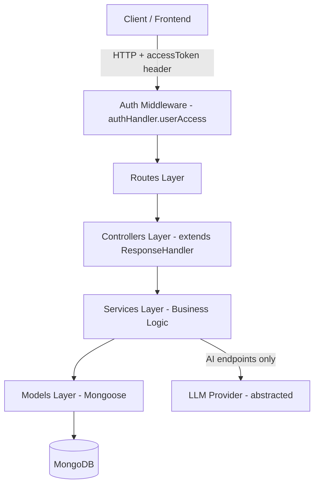

# Design Document: Money Mind Upgrade

## Overview

This design covers the backend upgrade of the Money Mind personal finance API. The upgrade spans 9 requirement areas: enhanced bank statement upload with preview and duplicate reporting, improved transaction annotation and sync, flexible transaction querying, new transaction grouping, enhanced debt management with payment recording and projections, new savings goal routes/service, new budget management routes/service, financial analytics aggregation endpoints, and AI-powered financial suggestion endpoints.

All new and modified endpoints follow the existing Controller → Service → Model pattern, use `asyncHandler` for MongoDB session/transaction management, `ResponseHandler` for consistent `SuccessMsgResponse` formatting, and the `ApiError` hierarchy (`CustomError`, `ClientError`, `AuthError`) for error responses. Authentication is enforced via `authHandler.userAccess` middleware on all routes. New route files are registered in `src/routes/index.ts` under `/api/v1`.

The design introduces 3 new Mongoose models (`TransactionGroup`, `DebtPayment`, `AIRequestLog`), modifies 0 existing model schemas (all existing schemas remain unchanged), and adds 5 new route/controller/service modules (`transaction-groups`, `goals`, `budgets`, `analytics`, `ai`). The debt module is extended with new endpoints in the existing route/controller/service files.

## Architecture

The system follows a layered architecture consistent with the existing codebase:



```

### New Module Structure

| Module | Route Path | Files |
|---|---|---|
| Transaction Groups | `/api/v1/transaction-groups` | `transaction-groups.route.ts`, `transaction-groups.controller.ts`, `transaction-groups.service.ts`, `transaction-group.model.ts` |
| Goals | `/api/v1/goals` | `goals.route.ts`, `goals.controller.ts`, `goals.service.ts` (uses existing `goals.model.ts`) |
| Budgets | `/api/v1/budgets` | `budgets.route.ts`, `budgets.controller.ts`, `budgets.service.ts` (uses existing `budget.model.ts`) |
| Analytics | `/api/v1/analytics` | `analytics.route.ts`, `analytics.controller.ts`, `analytics.service.ts` |
| AI | `/api/v1/ai` | `ai.route.ts`, `ai.controller.ts`, `ai.service.ts`, `llm-provider.ts` |
| Debt (enhanced) | `/api/v1/debt` (existing) | Extended `debt.route.ts`, `debt.controller.ts`, `debt.service.ts`, new `debt-payment.model.ts` |
| Transaction Logs (enhanced) | `/api/v1/transaction-logs` (existing) | Extended `transaction-logs.route.ts`, `transaction-logs.controller.ts`, `transaction-logs.service.ts` |

### Request Flow

Every request follows this flow:
1. Express receives the request at `/api/v1/{module}/{action}`
2. `authHandler.userAccess` validates the JWT from the `accessToken` header, attaches `req.user`
3. The controller method (wrapped in `asyncHandler`) starts a MongoDB session/transaction
4. The controller instantiates the service, passes request data
5. The service executes business logic against Mongoose models
6. On success, `asyncHandler` commits the transaction; the controller calls `this.sendResponse()`
7. On error, `asyncHandler` aborts the transaction and passes the `ApiError` to the error middleware

## Components and Interfaces

### 1. Transaction Logs Enhancements (Req 1, 2, 3)

**New Controller Methods** (added to `TransactionLogsController`):
- `previewUpload` — POST `/transaction-logs/preview-upload`: Returns would-be-inserted and would-be-skipped rows without persisting
- `listUploadKeys` — GET `/transaction-logs/list-upload-keys`: Returns distinct upload keys with counts (already exists, enhanced response)

**Enhanced Service Methods** (in `TransactionLogsService`):
- `previewUploadFromFile(rows, bankName)` — Runs the same HashMap duplicate detection as `uploadLogsFromFile` but returns `{ toInsert, toSkip }` without writing to DB
- `uploadLogsFromFile(rows, bankName)` — Enhanced to return `{ inserted, skipped, uploadKey }` (adds the uploadKey to the response)

**Validation additions**:
- Validate `rows` is a non-empty array, `bankName` is a non-empty string; throw `ClientError(400)` if missing

### 2. Transaction Groups (Req 4)

**New files**: `src/models/transaction-group.model.ts`, `src/services/transaction-groups.service.ts`, `src/controllers/transaction-groups.controller.ts`, `src/routes/transaction-groups.route.ts`

**TransactionGroupController** (extends `ResponseHandler`):
- `create` — POST `/transaction-groups/create`
- `addTransactions` — PUT `/transaction-groups/:id/add-transactions`
- `removeTransactions` — PUT `/transaction-groups/:id/remove-transactions`
- `list` — GET `/transaction-groups/list`
- `getById` — GET `/transaction-groups/:id`
- `update` — PUT `/transaction-groups/:id`
- `delete` — DELETE `/transaction-groups/:id`

**TransactionGroupService**:
- Constructor takes `userId: Types.ObjectId`
- `createGroup(groupName, description?)` — Creates group with empty `transactionIds`, `totalAmount: 0`
- `addTransactions(groupId, transactionIds[])` — Validates each transaction belongs to user, adds to group, recalculates `totalAmount`
- `removeTransactions(groupId, transactionIds[])` — Removes IDs, recalculates `totalAmount`
- `listGroups()` — Returns all groups for user with transaction count
- `getGroup(groupId)` — Returns group with populated transaction details
- `updateGroup(groupId, { groupName?, description? })` — Partial update
- `deleteGroup(groupId)` — Deletes group only, not underlying transactions
```

### 3. Debt Management Enhancements (Req 5)

**New model**: `src/models/debt-payment.model.ts` — Stores individual payment records for a debt

**New Controller Methods** (added to `DebtController`):

- `recordPayment` — POST `/debt/:debtId/record-payment`
- `paymentHistory` — GET `/debt/:debtId/payment-history`
- `payoffProjection` — GET `/debt/:debtId/payoff-projection`
- `debtSummary` — GET `/debt/summary`

**New Service Methods** (added to `DebtService`):

- `recordPaymentService(debtId, amount, paymentDate, transactionId?, userId)` — Creates a `DebtPayment` record, reduces `remainingAmount`, sets status to "PAID" if remaining ≤ 0
- `paymentHistoryService(debtId, userId)` — Returns all `DebtPayment` records for the debt
- `payoffProjectionService(debtId, userId)` — Calculates projected payoff date using standard amortization: `n = -log(1 - (r * P / M)) / log(1 + r)` where `r` = monthly interest rate, `P` = remaining amount, `M` = monthly EMI
- `debtSummaryService(userId)` — Aggregates total debt, total remaining, total monthly EMI, active vs paid counts

### 4. Goals Service (Req 6)

**New files**: `src/services/goals.service.ts`, `src/controllers/goals.controller.ts`, `src/routes/goals.route.ts`

**GoalController** (extends `ResponseHandler`):

- `create` — POST `/goals/create`
- `update` — PUT `/goals/:goalId`
- `list` — GET `/goals/list`
- `getById` — GET `/goals/:goalId`
- `delete` — DELETE `/goals/:goalId`
- `contribute` — POST `/goals/:goalId/contribute`
- `cancel` — PUT `/goals/:goalId/cancel`

**GoalService**:

- Constructor takes `userId: Types.ObjectId`
- `createGoal({ name, category, targetAmount, targetDate, priority?, description? })` — Creates with `savedAmount: 0`, `status: 'active'`
- `updateGoal(goalId, fields)` — Partial update of allowed fields
- `listGoals()` — Returns all goals for user
- `getGoal(goalId)` — Returns single goal
- `deleteGoal(goalId)` — Deletes goal
- `contributeToGoal(goalId, amount, transactionId?)` — Increases `savedAmount`, sets `status: 'completed'` if `savedAmount >= targetAmount`
- `cancelGoal(goalId)` — Sets `status: 'cancelled'`

### 5. Budget Service (Req 7)

**New files**: `src/services/budgets.service.ts`, `src/controllers/budgets.controller.ts`, `src/routes/budgets.route.ts`

**BudgetController** (extends `ResponseHandler`):

- `create` — POST `/budgets/create`
- `update` — PUT `/budgets/:budgetId`
- `list` — GET `/budgets/list`
- `getById` — GET `/budgets/:budgetId`
- `delete` — DELETE `/budgets/:budgetId`
- `calculateActuals` — POST `/budgets/:budgetId/calculate-actuals`
- `copyFromPrevious` — POST `/budgets/copy-from-previous`

**BudgetService**:

- Constructor takes `userId: Types.ObjectId`
- `createBudget({ month, categories, notes? })` — Validates no existing budget for month, calculates `totalPlanned` from sum of `plannedAmount`, sets `totalRemaining = totalPlanned`, `totalActual = 0`
- `updateBudget(budgetId, { categories?, notes? })` — Recalculates `totalPlanned` and `totalRemaining` if categories changed
- `listBudgets()` — Returns all budgets sorted by `month` descending
- `getBudget(budgetId)` — Returns single budget
- `deleteBudget(budgetId)` — Deletes budget
- `calculateActuals(budgetId)` — Queries `TransactionLogs` for the budget month (YYYYMM), matches by category name, updates each category's `actualAmount` and `remainingAmount`, updates budget totals
- `copyFromPrevious(targetMonth)` — Finds most recent budget before `targetMonth`, clones category structure with `actualAmount: 0`

### 6. Analytics Service (Req 8)

**New files**: `src/services/analytics.service.ts`, `src/controllers/analytics.controller.ts`, `src/routes/analytics.route.ts`

**AnalyticsController** (extends `ResponseHandler`):

- `incomeVsExpense` — GET `/analytics/income-vs-expense`
- `categoryBreakdown` — GET `/analytics/category-breakdown`
- `monthlyTrend` — GET `/analytics/monthly-trend`
- `savingsProgress` — GET `/analytics/savings-progress`
- `debtProgress` — GET `/analytics/debt-progress`
- `budgetVsActual` — GET `/analytics/budget-vs-actual`
- `topSpending` — GET `/analytics/top-spending`

**AnalyticsService**:

- Constructor takes `userId: Types.ObjectId`
- All methods use MongoDB aggregation pipelines on `TransactionLogs`, `Goal`, `Debt`, `Budget` collections
- Date range filtering via `dateFrom`/`dateTo` query params parsed with `dayjs`
- Returns empty arrays/zero totals when no data exists (no errors)
- Validates `dateFrom < dateTo` when both provided; throws `ClientError(400)` otherwise

### 7. AI Service (Req 9)

**New files**: `src/services/ai.service.ts`, `src/controllers/ai.controller.ts`, `src/routes/ai.route.ts`, `src/services/llm-provider.ts`

**LLM Provider Abstraction** (`src/services/llm-provider.ts`):

```typescript
interface ILLMProvider {
  complete(prompt: string, systemPrompt: string): Promise<string>;
}

interface ILLMProviderConfig {
  apiKey: string;
  model: string;
  maxTokens?: number;
  temperature?: number;
}
```

- `LLMProviderFactory.create(providerName: string, config: ILLMProviderConfig): ILLMProvider` — Factory method that returns the appropriate provider implementation
- Initial implementation: `OpenAIProvider` using the OpenAI chat completions API via `axios`
- Provider name configured via `LLM_PROVIDER` env variable, API key via `LLM_API_KEY`

**AIController** (extends `ResponseHandler`):

- `categorizeTransactions` — POST `/ai/categorize-transactions`
- `suggestGroups` — POST `/ai/suggest-groups`
- `debtStrategy` — POST `/ai/debt-strategy`
- `goalAdvice` — POST `/ai/goal-advice`
- `budgetRecommendations` — POST `/ai/budget-recommendations`
- `chat` — POST `/ai/chat`

**AIService**:

- Constructor takes `userId: Types.ObjectId` and `llmProvider: ILLMProvider`
- Each method gathers only the relevant financial data for context:
  - `categorizeTransactions(transactionIds[])` — Fetches transactions, sends narration+amount to LLM, returns suggested `{ category, labels }` per transaction
  - `suggestGroups(dateFrom?, dateTo?)` — Fetches transactions in range, asks LLM to identify grouping patterns
  - `debtStrategy()` — Fetches active debts, asks LLM for repayment strategy (avalanche/snowball/hybrid)
  - `goalAdvice()` — Fetches active goals + income + spending patterns
  - `budgetRecommendations(targetMonth)` — Fetches historical spending, asks LLM for category allocations
  - `chat(message)` — Fetches summary of user's financial data, processes free-form question

**Rate Limiting**:

- A simple in-memory rate limiter middleware applied to all `/ai` routes
- Configurable via `AI_RATE_LIMIT_PER_MINUTE` env variable (default: 10 requests/minute per user)
- Tracks requests per userId using a Map with TTL cleanup
- Returns `429 Too Many Requests` when limit exceeded

## Data Models

### New Models

#### TransactionGroup (`src/models/transaction-group.model.ts`)

```typescript
interface ITransactionGroup extends Document {
  userId: Types.ObjectId; // ref: 'User', required
  groupName: string; // required
  description?: string;
  transactionIds: Types.ObjectId[]; // ref: 'TransactionLogs'
  totalAmount: number; // default: 0
  isCredit?: boolean;
}
// Schema options: { timestamps: true, versionKey: false }
```

#### DebtPayment (`src/models/debt-payment.model.ts`)

```typescript
interface IDebtPayment extends Document {
  userId: Types.ObjectId; // ref: 'User', required
  debtId: Types.ObjectId; // ref: 'Debt', required
  amount: number; // required
  paymentDate: Date; // required
  transactionId?: Types.ObjectId; // ref: 'TransactionLogs', optional
  notes?: string;
}
// Schema options: { timestamps: true, versionKey: false }
```

#### AIRequestLog (`src/models/ai-request-log.model.ts`)

```typescript
interface IAIRequestLog extends Document {
  userId: Types.ObjectId; // ref: 'User', required
  endpoint: string; // e.g., 'categorize-transactions'
  requestTimestamp: Date; // default: Date.now
  responseTimestamp?: Date;
  tokenCount?: number;
  status: 'success' | 'error';
}
// Schema options: { timestamps: true, versionKey: false }
```

This model is used for tracking AI usage and supporting rate limiting persistence (optional, the in-memory rate limiter is the primary mechanism).

### Existing Models (Unchanged)

All existing model schemas remain unchanged:

- **TransactionLogs** — No schema changes. The `uploadKey` field already exists for batch tracking.
- **Debt** — No schema changes. Payment history is tracked via the new `DebtPayment` model rather than modifying the debt schema.
- **Goal** — No schema changes. Already has `name`, `category`, `targetAmount`, `savedAmount`, `targetDate`, `priority`, `description`, `status` fields.
- **Budget** — No schema changes. Already has `month`, `totalPlanned`, `totalActual`, `totalRemaining`, `categories[]`, `notes` fields.
- **Category**, **Labels**, **Income**, **User**, **UserLogin**, **Expense**, **Investment** — No changes.

### Key Integration Points

1. **Transaction → Group**: `TransactionGroup.transactionIds` references `TransactionLogs._id`. Adding/removing transactions recalculates `totalAmount` by summing the `amount` field of all linked transactions.

2. **Transaction → Debt Payment**: `DebtPayment.transactionId` optionally links a payment to a specific `TransactionLog`. The service verifies the transaction belongs to the user before linking.

3. **Transaction → Goal Contribution**: The `GoalService.contributeToGoal` method accepts an optional `transactionId` parameter. This is stored as metadata but does not create a separate model — the contribution is tracked by updating `savedAmount` on the Goal directly.

4. **Transaction → Budget Actuals**: `BudgetService.calculateActuals` queries `TransactionLogs` where `transactionDate` falls within the budget month and `category` matches a budget category name. It sums debit amounts per category.

5. **Analytics Cross-Module**: `AnalyticsService` reads from `TransactionLogs`, `Goal`, `Debt`, and `Budget` collections in read-only aggregation pipelines. No writes.

6. **AI Context Gathering**: `AIService` reads from all financial models to build context for LLM prompts. Each endpoint fetches only the minimum data needed (e.g., `debtStrategy` only fetches active debts, not transactions).

## Correctness Properties

_A property is a characteristic or behavior that should hold true across all valid executions of a system — essentially, a formal statement about what the system should do. Properties serve as the bridge between human-readable specifications and machine-verifiable correctness guarantees._

### Property 1: Upload duplicate detection and batch consistency

_For any_ array of transaction rows and any pre-existing set of transactions for a user, uploading the rows should result in: (a) inserted + skipped = total input rows, (b) only rows whose HashMap does not already exist are inserted, (c) all inserted records share a single UUID-based uploadKey, and (d) no pre-existing records are modified.

**Validates: Requirements 1.1, 1.2, 1.6**

### Property 2: Preview upload is read-only

_For any_ array of transaction rows and bankName, calling the preview-upload endpoint should return `toInsert` and `toSkip` arrays where `toInsert.length + toSkip.length = rows.length`, and the total count of TransactionLogs in the database should remain unchanged before and after the call.

**Validates: Requirements 1.3**

### Property 3: Upload key listing matches actual data

_For any_ user with uploaded transaction batches, the list-upload-keys endpoint should return one entry per distinct uploadKey, and each entry's count should equal the actual number of TransactionLogs with that uploadKey in the database.

**Validates: Requirements 1.7**

### Property 4: Single transaction update is partial

_For any_ TransactionLog and any subset of updatable fields (notes, category, label, isCredit), updating with only those fields should change exactly those fields and leave all other fields unchanged.

**Validates: Requirements 2.1**

### Property 5: Auto-creation of categories and labels on update

_For any_ category name or set of label names assigned to a TransactionLog via single update, after the update completes, those category and label names should exist in the `categories` and `labels` collections respectively for the authenticated user.

**Validates: Requirements 2.2, 2.3**

### Property 6: Bulk update applies to all matching transactions

_For any_ array of transaction updates and an uploadKey, after bulk update, every TransactionLog matching the provided IDs and uploadKey should reflect the updated notes, label, and category values.

**Validates: Requirements 2.4**

### Property 7: Sync upserts transactions and auto-creates labels

_For any_ array of transactions synced, after the sync: (a) all transactions should be persisted in the database, and (b) all label names referenced across the synced transactions should exist in the `labels` collection for the user.

**Validates: Requirements 2.5**

### Property 8: Cash memo has isCash flag

_For any_ cash memo created via add-cashmemo, the resulting TransactionLog should have `isCash` set to `true` and `userId` set to the authenticated user's ID.

**Validates: Requirements 2.8**

### Property 9: Transaction filtering correctness

_For any_ combination of filter parameters (uploadKey, amount, bankName, transactionType, type, labels, category, dateFrom, dateTo, keyword), all TransactionLogs returned by list-transactions should satisfy every active filter and belong to the authenticated user.

**Validates: Requirements 3.1, 3.2**

### Property 10: Pagination invariants

_For any_ query with page and limit parameters, the response should contain `totalCount` (a non-negative integer) and `result` (an array), where `result.length <= limit` and `totalCount >= result.length`.

**Validates: Requirements 3.3**

### Property 11: Delete-all removes all user data

_For any_ user, after calling delete-all-transactions, the count of TransactionLogs, Categories, and Labels belonging to that user should all be zero.

**Validates: Requirements 3.4**

### Property 12: Error response format consistency

_For any_ API error thrown via the ApiError hierarchy, the response body should contain `message` (string), `time` (date), `type` (string), and `status` (boolean) fields.

**Validates: Requirements 3.6**

### Property 13: Transaction group creation defaults

_For any_ groupName and optional description, a newly created TransactionGroup should have `transactionIds` as an empty array and `totalAmount` equal to 0.

**Validates: Requirements 4.2**

### Property 14: Transaction group totalAmount invariant

_For any_ TransactionGroup, after any sequence of add-transactions and remove-transactions operations, the group's `totalAmount` should always equal the sum of the `amount` fields of all TransactionLogs currently referenced in `transactionIds`.

**Validates: Requirements 4.3, 4.4**

### Property 15: Transaction group get returns populated details

_For any_ TransactionGroup with linked transactions, the get-by-id endpoint should return the group with fully populated TransactionLog details for every ID in `transactionIds`.

**Validates: Requirements 4.6**

### Property 16: Deleting a group preserves transactions

_For any_ TransactionGroup, after deletion, the group should no longer exist in the database, but all TransactionLogs that were referenced in its `transactionIds` should still exist.

**Validates: Requirements 4.8**

### Property 17: Debt payment reduces remaining amount

_For any_ active Debt and any positive payment amount, after recording the payment: (a) the Debt's `remainingAmount` should decrease by the payment amount (clamped to 0), (b) if the new `remainingAmount` is 0, `debtStatus` should be "PAID", and (c) a DebtPayment record should be created with the correct amount and date.

**Validates: Requirements 5.2, 5.4**

### Property 18: Debt payment transaction linking

_For any_ debt payment that includes a transactionId, the resulting DebtPayment record should reference that transactionId, and the referenced TransactionLog must belong to the authenticated user.

**Validates: Requirements 5.3**

### Property 19: Debt payment history completeness

_For any_ Debt with recorded payments, the payment history endpoint should return all DebtPayment records for that debt, and the sum of all payment amounts should equal `totalAmount - remainingAmount` of the debt.

**Validates: Requirements 5.5**

### Property 20: Debt payoff projection mathematical correctness

_For any_ Debt with positive remainingAmount, positive interestRate, and positive monthlyExpectedEMI where the EMI exceeds the monthly interest, the projected number of months should equal `ceil(-log(1 - (r * P / M)) / log(1 + r))` where `r` = interestRate/12/100, `P` = remainingAmount, `M` = monthlyExpectedEMI.

**Validates: Requirements 5.6**

### Property 21: Debt summary aggregation correctness

_For any_ set of debts belonging to a user, the summary's `totalDebt` should equal the sum of all `debtDetails.totalAmount`, `totalRemaining` should equal the sum of all `debtDetails.remainingAmount`, `totalMonthlyEMI` should equal the sum of all `debtDetails.monthlyExpectedEMI`, and active/paid counts should match the actual counts by `debtStatus`.

**Validates: Requirements 5.7**

### Property 22: Goal creation defaults

_For any_ valid goal creation input (name, category, targetAmount, targetDate), the created Goal should have `savedAmount` equal to 0 and `status` equal to "active".

**Validates: Requirements 6.2**

### Property 23: Goal contribution and auto-completion

_For any_ active Goal and any positive contribution amount, after contributing: (a) `savedAmount` should increase by exactly the contribution amount, and (b) if the new `savedAmount >= targetAmount`, the Goal's `status` should be "completed".

**Validates: Requirements 6.7, 6.8**

### Property 24: Goal cancellation sets status

_For any_ active Goal, after cancellation, the Goal's `status` should be "cancelled".

**Validates: Requirements 6.9**

### Property 25: Budget creation totalPlanned invariant

_For any_ budget creation with a categories array, `totalPlanned` should equal the sum of all `plannedAmount` values in the categories, `totalActual` should be 0, and `totalRemaining` should equal `totalPlanned`. After updating categories, `totalPlanned` should be recalculated to match the new sum.

**Validates: Requirements 7.2, 7.3**

### Property 26: Budget list is sorted by month descending

_For any_ user with multiple budgets, the list endpoint should return budgets where each budget's `month` value is greater than or equal to the next budget's `month` value in the array.

**Validates: Requirements 7.4**

### Property 27: Budget calculate-actuals matches transaction data

_For any_ Budget and the corresponding TransactionLogs in that budget's month, after calculating actuals: (a) each category's `actualAmount` should equal the sum of debit transaction amounts matching that category name, (b) each category's `remainingAmount` should equal `plannedAmount - actualAmount`, and (c) the budget's `totalActual` should equal the sum of all category `actualAmount` values.

**Validates: Requirements 7.7**

### Property 28: Budget copy-from-previous preserves structure

_For any_ existing Budget and a target month, copying from previous should create a new Budget where: (a) the category names and planned amounts match the source budget, (b) all `actualAmount` values are 0, (c) `totalPlanned` matches the source, and (d) `totalActual` is 0.

**Validates: Requirements 7.8**

### Property 29: Income vs expense aggregation correctness

_For any_ set of TransactionLogs in a date range, the income-vs-expense endpoint should return `totalCredit` equal to the sum of amounts where `isCredit=true`, `totalDebit` equal to the sum of amounts where `isCredit=false`, and `netAmount` equal to `totalCredit - totalDebit`.

**Validates: Requirements 8.2**

### Property 30: Category breakdown aggregation correctness

_For any_ set of TransactionLogs in a date range filtered by type, the category-breakdown endpoint should return entries where the sum of all `totalAmount` values equals the total of all matching transaction amounts, and each entry's `transactionCount` matches the actual count of transactions in that category.

**Validates: Requirements 8.3**

### Property 31: Monthly trend aggregation correctness

_For any_ set of TransactionLogs in a date range, the monthly-trend endpoint should return entries where each month's `totalCredit` and `totalDebit` equal the sum of credit and debit amounts respectively for transactions in that month, and `netAmount = totalCredit - totalDebit`.

**Validates: Requirements 8.4**

### Property 32: Savings progress percentage calculation

_For any_ set of active Goals, the savings-progress endpoint should return entries where `percentComplete` equals `(savedAmount / targetAmount) * 100` for each goal, and `daysRemaining` equals the number of days from now until `targetDate`.

**Validates: Requirements 8.5**

### Property 33: Debt progress percentage calculation

_For any_ set of active Debts, the debt-progress endpoint should return entries where `percentPaid` equals `((totalAmount - remainingAmount) / totalAmount) * 100` for each debt.

**Validates: Requirements 8.6**

### Property 34: Budget vs actual percentage calculation

_For any_ Budget with categories, the budget-vs-actual endpoint should return each category with `percentUsed` equal to `(actualAmount / plannedAmount) * 100`, handling the case where `plannedAmount` is 0.

**Validates: Requirements 8.7**

### Property 35: Top spending returns sorted debits

_For any_ set of TransactionLogs in a date range and a limit N, the top-spending endpoint should return at most N transactions, all with `isCredit=false`, sorted by `amount` in descending order.

**Validates: Requirements 8.8**

### Property 36: AI categorize returns one suggestion per transaction

_For any_ array of valid transactionIds belonging to the authenticated user, the categorize-transactions endpoint should return a response array with exactly one entry per input transactionId, each containing a suggested `category` (string) and `labels` (string array).

**Validates: Requirements 9.2**

### Property 37: AI rate limiting enforces per-user limits

_For any_ user making more than the configured rate limit of requests to AI endpoints within the time window, subsequent requests should be rejected with a 429 status code, while requests from other users should not be affected.

**Validates: Requirements 9.12**

## Error Handling

All error handling follows the existing `ApiError` hierarchy and patterns:

### Error Classes Used

| Error Class   | Status Code | Usage                                                                                                                                                |
| ------------- | ----------- | ---------------------------------------------------------------------------------------------------------------------------------------------------- |
| `ClientError` | 400         | Validation failures: missing fields, empty arrays, invalid amounts, invalid date ranges                                                              |
| `CustomError` | 400/404     | Business logic errors: "Debt not exist", "Goal not found", "Transaction group not found", "Budget not found", "Budget already exists for this month" |
| `AuthError`   | 401         | Authentication failures (handled by `authHandler`)                                                                                                   |
| `CustomError` | 503         | AI service unavailable (LLM provider errors)                                                                                                         |

### Error Response Format

All errors are returned via `ApiError.errorResponse()`:

```json
{
  "message": "descriptive error message",
  "time": "2024-01-01T00:00:00.000Z",
  "type": "CUSTOM ERROR",
  "status": false
}
```

### Validation Strategy

Input validation is performed at the service layer (consistent with existing code):

- **Required field checks**: Throw `ClientError(400)` with descriptive message
- **Ownership checks**: All queries filter by `userId` from `req.user._id`; throw `CustomError(404)` if not found
- **Amount validation**: Payment and contribution amounts must be positive; throw `ClientError(400)` if ≤ 0
- **Date range validation**: `dateFrom` must be before `dateTo`; throw `ClientError(400)` if invalid
- **Duplicate checks**: Budget month uniqueness per user; throw `ClientError(400)` if duplicate

### Transaction Safety

All write operations are wrapped in `asyncHandler` which:

1. Starts a MongoDB session and transaction
2. Commits on success
3. Aborts on any error
4. Passes errors to the Express error middleware

This ensures atomicity for multi-document operations like:

- Recording a debt payment (create DebtPayment + update Debt)
- Adding transactions to a group (update group + recalculate total)
- Calculating budget actuals (update multiple category entries + budget totals)

## Testing Strategy

### Property-Based Testing

**Library**: `fast-check` (already installed in the project as a dependency)

**Configuration**:

- Minimum 100 iterations per property test (`{ numRuns: 100 }`)
- Each test tagged with: `Feature: money-mind-upgrade, Property {N}: {title}`

**Approach**:

- Property tests validate the 37 correctness properties defined above
- Each property is implemented as a single `fc.assert(fc.property(...))` call
- Generators create random but valid inputs (transaction rows, amounts, dates, category names, etc.)
- Tests run against the service layer directly with a test MongoDB instance

**Key Generators Needed**:

- `arbitraryTransactionRow()` — Generates valid `ITransactionPayload` objects with random dates, narrations, amounts
- `arbitraryDebtDetails()` — Generates valid `IDebtDetails` with consistent amounts and dates
- `arbitraryGoalInput()` — Generates valid goal creation inputs
- `arbitraryBudgetCategories()` — Generates arrays of `{ categoryName, plannedAmount }` with positive amounts
- `arbitraryDateRange()` — Generates valid `{ dateFrom, dateTo }` pairs where `dateFrom < dateTo`
- `arbitraryPositiveAmount()` — Generates positive numbers for payments/contributions

### Unit Testing

Unit tests complement property tests for:

- **Specific examples**: Known edge cases like uploading exactly 0 rows, paying off a debt with exact remaining amount
- **Error conditions**: Invalid inputs (empty arrays, missing fields, negative amounts, non-existent IDs)
- **Integration points**: Verifying that debt payment correctly links to a transaction, budget calculate-actuals correctly matches categories
- **AI service**: Mocking the LLM provider to test error handling (503 response), rate limiting (429 response), and response parsing

### Test Organization

```
src/tests/
  transaction-logs.test.ts      — Properties 1-12 + edge cases
  transaction-groups.test.ts    — Properties 13-16 + edge cases
  debt.test.ts                  — Properties 17-21 + edge cases
  goals.test.ts                 — Properties 22-24 + edge cases
  budgets.test.ts               — Properties 25-28 + edge cases
  analytics.test.ts             — Properties 29-35 + edge cases
  ai.test.ts                    — Properties 36-37 + edge cases
```
